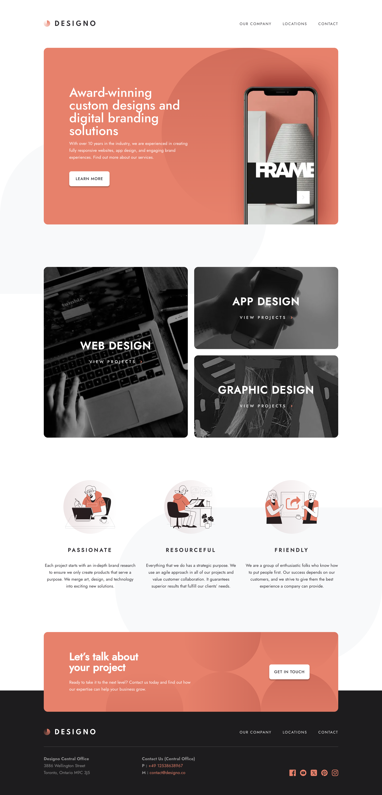

# Frontend Mentor - Designo agency website solution

This is a solution to the [Designo agency website challenge on Frontend Mentor](https://www.frontendmentor.io/challenges/designo-multipage-website-G48K6rfUT). Frontend Mentor challenges help you improve your coding skills by building realistic projects.

## Table of contents

- [Overview](#overview)
  - [The challenge](#the-challenge)
  - [Screenshot](#screenshot)
  - [Links](#links)
- [My process](#my-process)
  - [Built with](#built-with)
  - [What I learned](#what-i-learned)
  - [Continued development](#continued-development)
  - [Useful resources](#useful-resources)

## Overview

### The challenge

Users should be able to:

- View the optimal layout for each page depending on their device's screen size
- See hover states for all interactive elements throughout the site
- Receive an error message when the contact form is submitted if:
  - The `Name`, `Email Address` or `Your Message` fields are empty should show "Can't be empty"
  - The `Email Address` is not formatted correctly should show "Please use a valid email address"
- **Bonus**: View actual locations on the locations page maps (using [Leaflet JS](https://leafletjs.com/))

### Screenshot

### Links

### Links

- Frontend Repository: [https://github.com/DeveloperMajd/designo-frontend.git](https://github.com/DeveloperMajd/designo-frontend.git)
- Backend Repository: [https://github.com/DeveloperMajd/designo-backend.git](https://github.com/DeveloperMajd/designo-backend.git)
- Live Site URL: [https://designo-frontend.developermajd.com/](https://designo-frontend.developermajd.com/)

## My process

I started by building the frontend with hardcoded content to closely match the Figma design. Once the visual layout looked good, I set up the backend using Strapi, fetched the data, and replaced the hardcoded content with dynamic content from the backend. After that, I added animations to enhance the user experience.

One of the main challenges was hosting Strapi on a VPS, which proved to be tricky. Moving forward, I’d prefer using WordPress with Advanced Custom Fields (ACF) for greater customization and easier management.

### Built with

- HTML
- SCSS
- TypeScript
- React
- Next.js
- Bulma
- Leaflet
- Strapi (backend)

### What I learned

- I learned how to use Strapi for the first time, which helped me understand backend content management.
- I also learned about hosting and managing domains, expanding my deployment skills.

### Continued development

In future projects, I want to focus more on accessibility and SEO, as I did not consider these aspects in this project but recognize their importance.

### Useful resources

- Learned Strapi through various YouTube tutorials.
- For the frontend, I built upon knowledge from past projects to structure and style the application.
