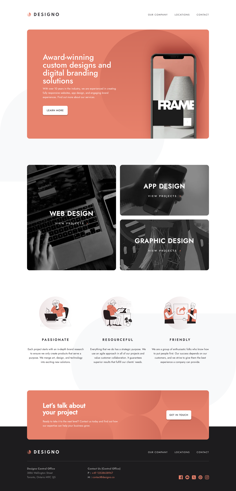

# Designo — Frontend

A multi-page website for a design agency, rendered from content managed in a headless CMS.
Built with **Next.js** and **TypeScript** on top of a Strapi API, from the
[Frontend Mentor Designo challenge](https://www.frontendmentor.io/challenges/designo-multipage-website-G48K6rfUT)
design.

|  |  |
| --- | --- |
| Live site | <https://designo.developermajd.com> |
| Backend (Strapi API) | [DeveloperMajd/designo-backend](https://github.com/DeveloperMajd/designo-backend) |
| Project overview | [DeveloperMajd/designo](https://github.com/DeveloperMajd/designo) |



## Features

- **Pages driven by the CMS.** A page is an ordered list of sections stored in Strapi.
  The frontend renders whatever the editor composes, so pages can be added or reordered
  without a code change.
- **Static and fast.** Pages are prerendered and refreshed in the background every two
  minutes (incremental static regeneration), so content edits go live without a rebuild.
- **Editable everywhere.** Navigation, footer details and interface labels come from the CMS
  too.
- **Locations page with maps.** Interactive Leaflet maps with OpenStreetMap tiles, loaded
  on the client only.
- **Contact form** with inline validation and clear feedback when sending fails
  (validation errors, rate limiting, network and server errors). Rate limiting and input
  hardening happen on the backend.
- **Motion.** Scroll-triggered animations with Framer Motion.
- **Responsive.** Layouts for mobile, tablet and desktop, built with Bulma and SCSS.
- **SEO basics.** A title per page, a description, canonical URLs and Open Graph tags;
  unknown URLs return a real 404.

## How it works

- `src/pages/[[...dynamicRoute]].tsx` is the only route. `getStaticPaths` asks the API for
  every page slug; `getStaticProps` fetches the page, the menu, the labels and the contact
  details.
- Each section type in the CMS (for example `components.homepage-banner`) is mapped to a
  React component in `src/utils/module-list.tsx`. The page layout is whatever order the
  editor chose.
- New pages are generated on their first visit (`fallback: "blocking"`). A slug the API has
  no page for returns a 404. If the API cannot be reached, a page that was already
  generated keeps being served instead of being replaced by an error.

## Tech stack

| Area | Tools |
| --- | --- |
| Framework | Next.js 15 (pages router), React 19, TypeScript |
| Styling | SCSS, Bulma |
| Animation | Framer Motion, react-intersection-observer |
| Maps | Leaflet, React Leaflet |
| Data | Strapi REST API, `qs` for query strings |
| Utilities | libphonenumber-js, hamburger-react |
| Hosting | Vercel |

## Getting started

Requires **Node 20 or newer** and **yarn**. The site reads all of its content from the
Strapi API, so the backend has to be running.

The easiest way is `make dev` from the
[project repo](https://github.com/DeveloperMajd/designo), which starts the backend and this
frontend together. To run only the frontend against a local backend:

```bash
yarn install
echo 'NEXT_PUBLIC_API_URL=http://localhost:1337/api' > .env.local
yarn dev
```

Open <http://localhost:3000>. `.env.local` is ignored by git and overrides the
production URL in `.env`.

| Script | What it does |
| --- | --- |
| `yarn dev` | Development server |
| `yarn build` | Production build (also lints and type-checks) |
| `yarn start` | Serve the production build |
| `yarn lint` | Run ESLint |

## Configuration

| Variable | Purpose |
| --- | --- |
| `NEXT_PUBLIC_API_URL` | Base URL of the Strapi API, including `/api`. The host of this URL is also allowed as an image source in `next.config.js`, so pointing the site at a different backend needs no code change. |

`NEXT_PUBLIC_*` values are inlined at build time, so changing one needs a rebuild.

## Deployment

The site is deployed on Vercel, straight from this repository: every push to `master` builds
and deploys. Set `NEXT_PUBLIC_API_URL` in the Vercel project settings (or keep the value in
`.env`), and redeploy after changing it.

Vercel refuses to deploy Next.js versions with known security advisories, so the framework
has to be kept up to date.

## Project structure

```
src/
  pages/[[...dynamicRoute]].tsx   the only route: fetches a page by slug and renders it
  components/                     one component per CMS section, plus navbar and footer
  hooks/                          data fetching and small UI hooks
  utils/                          section-to-component map, API types, helpers, site constants
  styles/                         SCSS partials, one per component
  assets/                         fonts, images and SVGs
```

## Known limitations

- **Accessibility** has not been audited yet (keyboard navigation, focus handling, ARIA).
- **Meta descriptions** are one site-wide text; the CMS has no per-page description field.
- There are **no automated tests** yet.

## Credits

Design and image assets by [Frontend Mentor](https://www.frontendmentor.io). Typeface:
Jost. Map data © [OpenStreetMap](https://www.openstreetmap.org/copyright) contributors.
